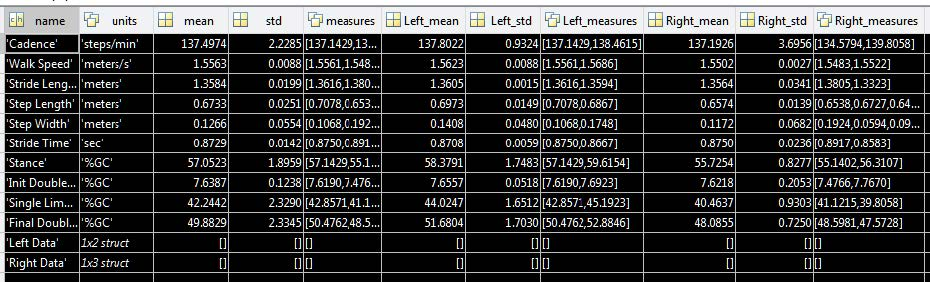
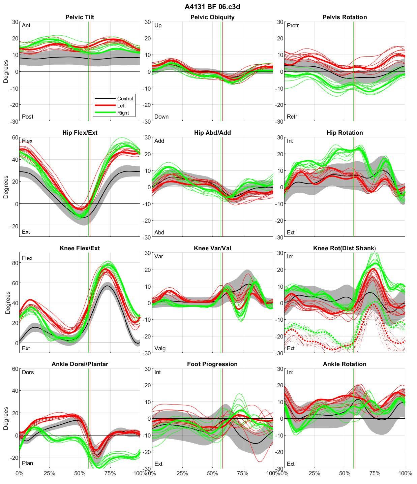
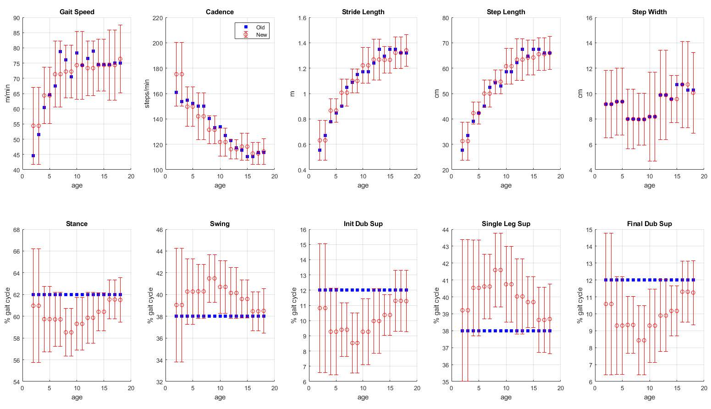

# WAAAG

Walking Ability-At-A-Glance Version 2

## Description
Walking Ability At A Glance (WAAAG) calculates and displays various measures of a person’s gait pattern. WAAAG is used to determine the representative gait cycle, to calculate average rotations, to generate plots and tables of temporal-spatial walking parameters and GDI, and to obtain the average kinematic rotations. WAAAG can process up to 4 conditions simultaneously: Current, AFO, Last, and Extra slots, all of which can be renamed for the graphical and table outputs. WAAAG can be used for temporal spatial analysis among any/all conditions (heel & toe markers only). WAAAG data is automatically saved so the computations can always be double checked, and the data can be used elsewhere.

Version 2 updates include:
- New processing via ProcessC3D
- Temporal spatial parameters now calculated for every gait cycle
- Use of an excel file to select various input parameters
- New temporal-spatial norms
  - standard deviations now used in the temporal-spatial figure
- Score Sara functionality
- Ankle dorsi/plantar flexion and knee AB/AD average rotation

## Instructions
1. For the new user, copy the WAAAG V2 folder from ‘S:\cgma_TechOps\Software\Matlab Programs\Deployed\WAAAG’ into your MATLAB folder
2. Copy desired C3D files into the WAAAG folder
3. Open the ‘Processing_Selection.xlsx’ spreadsheet and select your desired processing scheme
a. See the WAAAG processing options to further accelerate processing time (optional)
4. Open MATLAB, run WAAAG, and follow any input prompts (number of required inputs depends on processing scheme)
5. You will now find the following in a new folder:
  i. The folder will be named in the first line of the Processing_Selections spreadsheet
  ii. WAAAG_data.mat – all outputs, selections, and inputs from running WAAAG
  iii. Ave_Rotations.gcd – and any other GCD files depending on the conditions selected (AFO_Ave_Rotations, Last_ Ave_Rotations, Extra_ Ave_Rotations). These are ready for input into Polygon.
  iv. GaitMeasures.png – a saved plot of the temporal spatial parameters, referenced to normal
  v. GDI-MAP.png – a saved plot of the GDI and MAP scores. See details below
  vi. WAAAG.xlsx – this contains descriptions of the rep trial, rep cycles, type of input, values for all the gait measures metrics, Ranking of trials and cycles, and the average rotations for each condition. Be sure to check out the multiple sheets.
  vii. Optional outputs
  viii. Kinematic Plots (png file) – plot of gait-cycle parsed kinematics depending on input selections. See the Processing Selections spreadsheet for more info

## Detailed Description of Updates
### Excel File to define Processing Selections
By defining processing selections and inputs prior to running WAAAG, processing time can be shortened and automated. Use the series of drop downs and blanks to define subject parameters, kinematics data processing selections, plotting options, and WAAAG conditions. Below is an example.

### ProcessC3D info
ProcessC3D functionality is a totally new data processing software, compared to WAAAG V1 or GAMS (previous iterations of this software). This upgrade includes many additional features including:
• Ability to plot kinematic curves if desired
• Display of current trial being loaded – to identify the trial with missed gait events or bad data
• temporal-spatial data for each gait cycle of each trial
• raw and parsed kinematic data
• data saved in structure format for simple navigation
• Can also be used for normal database processing or compiling many C3Ds together

Structure organization makes it easy to find the data you need.

Aggregate data shows metrics from all trails – rep trial, rep cycles, GDI scores, ensemble averages, and settings.

Example of new temporal-spatial data structure. All temporal spatial measures in WAAAG tables are computed as the average of the temporal spatial measures from every gait cycle from each trial imported into WAAAG.

### Plotting Kinematics
The new processing also allows for automated export of kinematic plots. These can be customized to plot the representative cycle or ensemble average curve. Also one can add curves from all gait cycles from all trials (below) or show a band of the standard deviation around the average (next page). Average rotations can also be plotted.

Example kinematic graphs with the rep cycle in the solid line, average rotations as the horizontal lines, and a band of the mean with one standard deviation above and below.

### New Temporal-Spatial Norms
Standard deviations for all temporal-spatial parameters were needed for inclusion into the the bands within the temporal spatial parameters plots. These metrics were calculated from CGMAs database of typical walkers and used in place of the old GAMS measures, whose origin is uncertain. Below is a series of plots comparing the old (blue) and new (red) temporal spatial measures for each age group. The general trends are the same, however the addition of temporal-spatial measures provides valuable info.

The benefit of the new temporal-spatial norms is that the standard deviations can be used to set acceptable ranges for each measure, rather than relying on the percentage-based values in WAAAG V1.1. The ‘Ok’ and ‘Poor’ ranges were respectively set at 90 and 75% of the target. Now they are set at 1 and 3 standard deviations of the normal group from the norm average.

